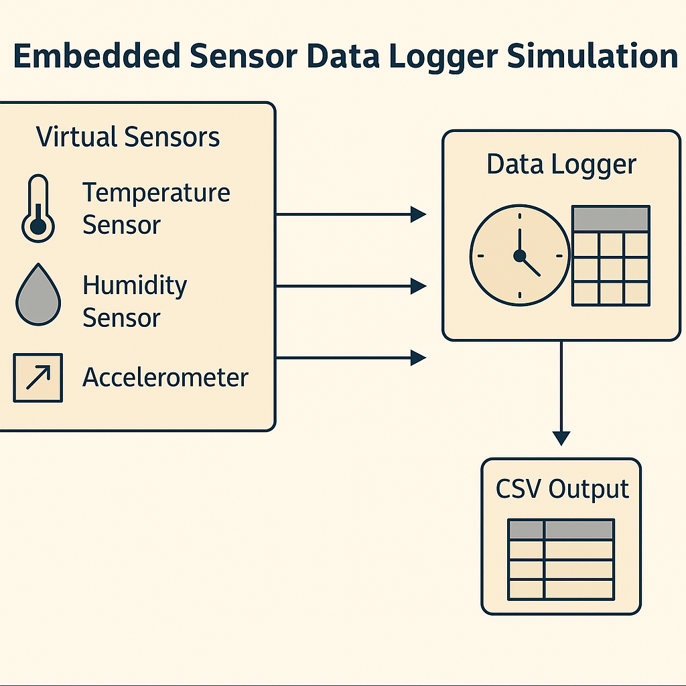

# 📊 Embedded Sensor Data Logger Simulation (C++)

A lightweight C++ simulation of an embedded system that reads from mock temperature and humidity sensors, timestamps the data, and logs it to a CSV file — mimicking a real-world sensor data logger.



## 🔧 Features

- Simulates multiple sensors (Temperature, Humidity)
- Logs timestamped data to `sensor_log.csv`
- Modular design using OOP principles
- Doxygen documentation for each component
- Easy to compile and run with CMake

---

## 🗂️ Project Structure

├── CMakeLists.txt
├── EmbeddedSensorLogger.png
├── include
│   ├── logger.hpp
│   ├── sensor.hpp
│   └── simulator.hpp
├── README.md
└── src
    ├── logger.cpp
    ├── main.cpp
    ├── sensor.cpp
    └── simulator.cpp
---

## 🛠️ Build Instructions

### 📦 Build and Run:

```bash
# Clone the repo
git clone git@github.com:ahmedsheaira/sensor_logger_sim.git
cd sensor_logger_sim

# Build
mkdir _build
cd _build
cmake ..
make

# Run
./EmbeddedSensorLogger
```

### 📊 Sample Output

```text
Timestamp,Sensor,Value
2025-04-16 16:25:30,Temperature,25.42
2025-04-16 16:25:30,Humidity,56.8
...
```

### 📘 Documentation

```bash
doxygen Doxyfile
# Open docs/html/index.html in your browser
```